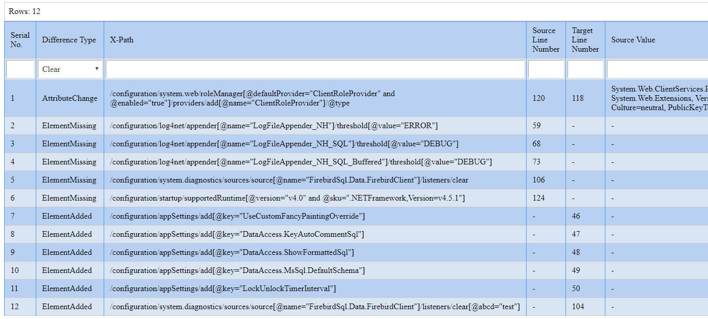

# Project Description 

Day in Day out while testing we do a comparison of these files which could be very complex and contain a large number of key-value pairs (out of order). It is a repetitive task and is very time consuming. 

Reconciliation of attributes present in XML's and JSON.

## Benefits
Previously the comparison was being done manually. Here we have built a reusable UIPath Activity.
1. Cost Saving and time saving (XML with 10M records processing in under 3 minutes)
2. Reporting
3. Reusability and open to use for all

## Business Use cases 

1. In a bank, a trade booking system is being migrated on to a new version and you need to compare/test the publication of trades. You need to be sure that all the attributes being sent are present and correctly mapped.

2. E-Commerce exchanges their data using XML with different applications and services. Hence the schema of the data changes. This tool can be used to validate the data before the data gets consumed.

# Implementation
User needs to drop an email with the location of the file which needs to be compared. BOT would be polling the inbox and would trigger the process which will read the file and do a comparion. In case there are mismatches it will reply back on the same email with an html report highlighting the gaps.
If there are no discrepancies encountered a success mail would be sent out. 

# Process Flow

1. The tool monitors the number of unread emails with subject containing the word _compare_
2. Picks the files contained in the email compares the source and target files
3. Source and Target files are specified by the user sending the email
4. Creates a result file after reconciliation
5. User gets back and email with the comparison result

## Sample User Email

# System Requirements

1. .Net 4.6.1
2. UIPath Studio 2019.7.0 
3. UIPath Robot 

# Scenerios Handled in the application

## XML and JSON interfile format comparison

1. The tool handles malformed files
2. The tool can handle cases where the order of keys is not the same across the two files
3. It can handle cases where the key names are not same across files. This is achieved using a mapping file supplied by the user
4. If source or target is not present the comparison fails
5. In case some different files format is provided, a failure mail is sent

# Intuitive Reporting

1. The report renders as an HTML, hence making it available anywhere
2. The report provides advance search and filters to narrow down results

## Sample Report

# Future Steps

1. Integration with AWS for storing and reading the data on s3 (WIP)
2. Integration with other popular file formats like CSV, protobuf, yml etc
3. Maintaining record of all the comparisons in a NoSQL db
